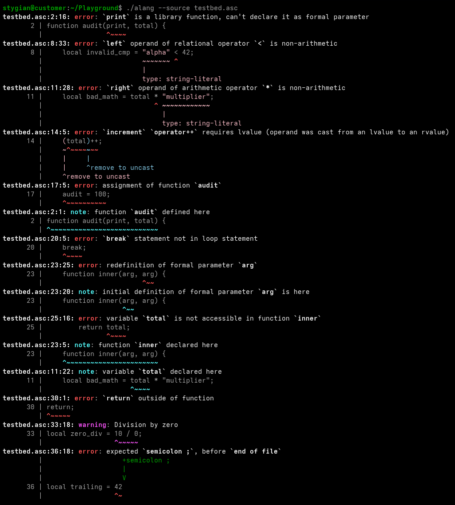

# The Alpha Programming Language & Toolchain

A modern, high-performance compiler and virtual machine for the Alpha language built in C++20. 
Alpha skips traditional AST construction in favor of single-pass, syntax-directed translation 
directly to a linear Three-Address Code (TAC) intermediate representation. 
The toolchain features a compile-time meta-programmed IR pipeline, swappable high-throughput lexing engines,
an invariant-guarded IR optimizer, clang-style diagnostic rendering, and an integrated 400ish-test oracle regression harness.

>  **Looking for the compiler internals and design tradeoffs?**  
> Jump directly to the [🏛️ Architectural Analysis](#architectural-analysis).


---

## Key Highlights

* **Direct Syntax-Directed TAC Emission:** Bypasses in-memory Abstract Syntax Tree (AST) heap allocations, 
    streaming linear Three-Address Code quads directly from grammar reductions for high compilation throughput.
* **Declarative IR Metaprogramming:** Intermediate representation opcodes, operand types, and compiler traits 
    are defined centrally in a YAML specification that autogenerates type-safe C++ reflection headers and runtime traits.
* **Dual Lexical Backends:** Toggle between a table-driven Flex reference scanner and a custom zero-allocation DFA engine 
    (`ScannerAutomaton`) featuring null-padded multi-character lookahead and length-partitioned keyword triaging.
* **Contract-Guarded Optimizer:** Transforms intermediate representation quads via constant folding, jump threading, 
    dead-function pruning, and scope hoisting—sandwiched between pre- and post-optimization validation firewalls.
* **Hydra Regression Harness:** A self-contained test engine executing ~400 test suites asserting exact CSV quads, 
    symbol tables, compiler diagnostics, and final VM runtime output under optional full Valgrind leak auditing.

---

##  Quick Start

### Build the Toolchain

Prerequisites: A C++20 compiler (Clang++ or GCC), CMake (>= 3.18), Flex, Bison, and Python 3 .

```bash
# Configure an optimized build
cmake -B build -DOPTIMIZED_MODE=ON

# Compile the alang compiler and avm virtual machine
cmake --build build -j
```

Compiled binaries are placed in `build/executables/`.

---

### Compile & Run Your First Program

The compiler automatically outputs generated bytecode files (`.abc`) into an `ABC_BINARIES/` folder in your current working directory:

```bash
# 1. Write an Alpha program
echo 'print("Hello, ", input("Enter your name: "), "! Welcome to Alpha!\n");' > hello.asc

# 2. Compile to Alpha-Binary-Code (generates ABC_BINARIES/hello.abc)
./build/executables/alang --source hello.asc

# 3. Execute on the Alpha Virtual Machine
./build/executables/avm --source ABC_BINARIES/hello.abc
```


#### Essential Compiler Inspection Flags
Inspect intermediate representations and symbol tables without extra tools:

```bash
# Inspect the generated TAC quad stream
./build/executables/alang --source hello.asc --show_ir

# Run with constant folding and dead code elimination enabled
./build/executables/alang --source hello.asc --opt_const_eval --opt_dead_code_elimination

# Inspect the symbol table (excluding internal compiler temporaries)
./build/executables/alang --source hello.asc --show_symbol_table_without_temps

# Pretty-print disassembled Alpha-Binary-Code bytecode
./build/executables/alang --source hello.asc --show_abc

# View all available optimization, inspection, and export options
./build/executables/alang --help
```

---
<a id="architectural-analysis"> </a>

# Architectural Analysis

## Dual-Engine Lexical Analysis: Flex vs. Hand-Crafted DFA
Alpha features two interchangeable scanner implementations selectable at build time via
CMake (`-DUSE_FLEX_SCANNER=ON/OFF`). 
Both engines feed directly into the Bison parser via a unified [ScannerAdapter](./scanner/include/scanner/scanner_adapter.hpp) layer:

* **Reference Scanner (Flex):** A battle-tested, reentrant, regex-driven scanner. 
    It acts as the functional ground truth for grammar integration, token stream validation, and syntax recovery.
* **Optimized Engine (`ScannerAutomaton`):** A custom hand-rolled deterministic finite automaton engineered for high-throughput source scanning.

```
                  Source Buffer (TranslationUnitBuffer)
                                    │
                  ┌─────────────────┴─────────────────┐
                  │                                   │
      [-DUSE_FLEX_SCANNER=ON]             [-DUSE_FLEX_SCANNER=OFF]
                  ▼                                   ▼
             Flex Scanner                      ScannerAutomaton
         (Table-driven Regex)               (Hand-rolled Direct DFA)
                  │                                   │
                  └─────────────────┬─────────────────┘
                                    │
                                    ▼
                         alpha::ScannerAdapter
                                    │
                                    ▼
                        Bison Parser (alpha_yylex)
```

### Low-Level Engineering in `ScannerAutomaton`

Rather than relying on generic regular expression engines, the handwritten automaton employs low-level systems optimizations:

* **Guaranteed Null-Padded Buffer:** Source buffers guarantee at least two trailing sentinel null bytes. Lookahead checks execute without branch-heavy EOF boundaries on every character.
* **Length-Partitioned Keyword Triaging:** Identifiers skip hash table lookups and standard `strcmp` cascades. Identifier tokens determine word length upfront and triage keywords via nested switch statements over length and initial bytes before validating string equality.
* **Allocation-Free Conversions:** Numeric literals avoid string copies or `std::stod`/`std::stoll` heap allocations, converting directly from in-buffer pointer ranges via `std::from_chars`.
* **Span-Only Token Views:** Identifier and string tokens emit non-owning `StringSpan` / `std::string_view` references pointing straight into the source buffer, eliminating token-level string allocations in the hot scanning loop.
* **Non-Bailing Scanner Recovery:** Malformed numeric literals (e.g., missing exponent digits, invalid suffixes) emit localized diagnostics via `DiagnosticReporter` while yielding fallback valid tokens (`TKN_INT`, `TKN_FLOAT`) rather than immediately aborting, preventing parser panic-mode cascades.

---

## Diagnostic Engine & Source Tracking 🩺

A declarative compiler diagnostic pipeline driven by a custom YAML specification and an automated Python code generator.
Emits Clang-style terminal diagnostics with ANSI colors, multi-span underlines, context labels, and inline suggestions.

* **Spec-Driven Diagnostics:** Centralized YAML definitions generate strongly typed C++ reporters, severity enums, and static format checkers.
* **Compact Byte-Offset Spans:** Expression nodes and tokens carry zero line/column overhead, tracking lightweight byte-offset spans ([SourceLocation](./core/include/core/source_location.hpp)) that combine via span-merging utilities.
* **Deferred Location Resolution:** Lexing and parsing bypass column arithmetic entirely; ([LocationTracker](./core/include/core/source_location_tracker.hpp)) lazily maps byte offsets to line/column coordinates via binary search only when an error or warning is reported.
* **Rich Multi-Span Visuals:** Renders precise source slices with carets, secondary spans, and suggested token insertions.

```javascript
// Library function redefinition as formal parameter
function audit(print, total) {
  return print;
}

function process() {
  // Relational operand mismatch with multi-span highlights
  local invalid_cmp = "alpha" < 42;

  // Arithmetic on non-arithmetic operand
  local bad_math = total * "multiplier";

  // Cast from lvalue to rvalue under operator
  (total)++;

  // Assignment to a defined function
  audit = 100;

  // Loop control keyword outside of any loop
  break;

  // Redefinition of existing formal parameter
  function inner(arg, arg) {
    // Variable not accessible in nested function
    return total;
  }
}

// Return keyword outside of any function scope
return;

// Division by zero warning
local zero_div = 10 / 0;

// Missing semicolon before end of file (triggers suggestion)
local trailing = 42
```


---

## Semantic Routing & Subsystem Architecture

To eliminate semantic action bloat in the parser grammar and guarantee fail-fast diagnostic recovery, 
the compiler decouples parsing from semantic evaluation via a layered subsystem architecture driven 
by a static compile-time string dispatcher (`SemanticSystem`).

```
┌───────────────────────────────────────────────────────────────────────────────┐
│                   Bison LALR(1) Parser                                        │
│                                                                               │
│  expr PLUS expr { ss.call<"basic_builder.build_arithmetic">(Op::ADD, ...); }  │
└───────────────────────────┬───────────────────────────────────────────────────┘
                            │ ss.call<"subsystem1.subsystem2.method">(...)
                            ▼
┌────────────────────────────────────────────────────────┐
│                 alpha::SemanticSystem                  │
│                                                        │
│  [Dispatcher Gate]                                     │
│                                                        │
│  L2 Builders & Managers:                               │
│  ├── basic_builder        ├── lvalue_resolver          │
│  ├── assign_builder       ├── control_flow_manager     │
│  ├── call_builder         ├── function_builder         │
│  └── aggregate_builder    └── table_access_builder     │
│                                                        │
│  L3 Core Shared Infrastructure:                        │
│  ├── ExprMaker            ├── ExprOptimizer            │
│  ├── QuadHandler          ├── ExprNormalizer           │
│  └── QuadInterceptor      └── QuadYielder              │
└────────────────────────────────────────────────────────┘
```

### Architectural Highlights

* **Zero-Cost Compile-Time Routing:** Actions dispatch via `ss.call<"module.method">(args...)`. The call string is resolved at compile time using `FixedString` and `if constexpr` branch chains, folding the invocation directly into a direct member call without runtime hashing or virtual function overhead.
* **Typo-Proof Dispatch Diagnostics:** If a grammar rule specifies an invalid module name or misspelled action string, the dispatcher falls through to an `UnknownCallStr<FixedString>` template specialization, triggering a descriptive `static_assert` diagnostic identifying the offending string during compilation.
* **Fail-Fast Error Short-Circuiting:** Every master dispatch call evaluates `good()` before forwarding arguments. If an earlier semantic step fails, downstream builder actions automatically abort and return safe default values (`nullptr`, `void`, or value-initialized defaults), preventing cascading null pointer dereferences without polluting individual builders with repetitive error checks.
* **Encapsulation via `Restricted` Subsystems:** Builder implementations are private to nested `Restricted` structs. Only the designated dispatch target surfaces callable operations, preventing accidental cross-subsystem coupling.
* **Deterministic L3 Service Ordering:** Core lowering services (such as `ExprMaker` and `QuadHandler`) are isolated behind runtime initialization assertions (`require_ptr(...)`), guaranteeing that dependency order violations across builders fail immediately at startup.

---

## IR Opcode Metaprogramming & Code Generation Pipeline

To ensure absolute synchronization across IR emission, intermediate optimization passes,
and VM target dispatch, IR opcodes are declared declaratively via a custom YAML-inspired
specification DSL ([**ir_opcode_spec.yaml**](./parser/config/ir_opcode_spec.yaml)).
A Python-driven metaprogramming toolchain translates this specification directly into type-safe,
compile-time C++ headers and reflection sources.

```
                    ┌────────────────────────────┐
                    │  ir_opcode_spec.yaml(DSL)  │
                    └─────────────┬──────────────┘
                                  │
                    ┌─────────────▼──────────────┐
                    │       generator.py         │
                    │  (YamlParser + CPPGenerator)
                    └─────────────┬──────────────┘
                                  │
        ┌─────────────────────────┴─────────────────────────────┐
        ▼           (Target: build/AUTOGEN/parser/)             ▼
   ┌────┴───────────────────────────────┐         ┌─────────────┴─────────────┐
   │ include/parser/                    │         │ src/                      │
   │  ├── ir_opcode.gen.hpp             │         │  └── ir_opcode.gen.cpp    │
   │  ├── ir_opcode_info_traits.gen.hpp │         └───────────────────────────┘
   │  └── ir_opcode_opt_traits.gen.hpp  │
   └────────────────────────────────────┘
```

### Architecture Highlights
* **Single Source of Truth:** Defining an opcode in [ir_opcode_spec.yaml](./parser/config/ir_opcode_spec.yaml) synchronizes the enum definitions, operand constraints, and optimization capabilities across the compiler.
* **Compile-Time Resolution:** Opcode traits (e.g., branch targets, operand requirements) evaluate statically at compile time, eliminating runtime lookup overhead in optimization passes.
* **Clean Build Isolation:** Generated C++ artifacts live strictly in `build/AUTOGEN/parser/` to keep handwritten code decoupled from derived files.
* **Spec Validation:** The Python parser catches schema errors, invalid types, and duplicate declarations at build time before invoking the C++ compiler.

## IR Transformation & Optimization Passes
Following syntax-directed translation, the linear Three-Address Code (TAC) quad stream passes through modular optimization pipelines before lowering to VM bytecode:
* **Constant Folding & Arithmetic Trimming:** Evaluates constant expressions at compile time and trims identity operations (e.g., `x + 0` $\rightarrow$ `x`) directly from the quad stream.
* **Control-Flow Simplification:**
  * **Jump Threading:** Traverses and flattens transitive jump chains (e.g., `jump A; A: jump B;` $\rightarrow$ `jump b;`).
  * **neighbor jump elimination:** converts redundant jumps targeting adjacent instructions into natural fall-throughs.
* **Dead Code & Scope Pruning:**
  * **Dead Function Elimination:** Prunes function definitions unreferenced across the translation unit.
  * **Dead Branch Elimination:** Eliminates unreachable blocks guarded by compile-time invariants.
* **Function Hoisting:** Lifts nested function bodies to the top of the quad stream, removing runtime jump-around wrappers.
* **Pre/Post-Optimization Verification:** The `ir_validator` executes as an invariant gate before and after transformation passes, confirming operand arity, variable lifetimes, and branch targets derived from `ir_opcode_spec.yaml`.

## Verification & Regression Testing ([Hydra](./scripts/hydra))

Alpha integrates a custom automated regression runner named **Hydra** paired with an extensive oracle test suite ([GOSPEL](.GOSPEL/), containing **399 test suites**). The test runner enforces end-to-end correctness across lexical analysis, syntax-directed translation, IR optimization passes, and virtual machine bytecode execution.

---

### Self-Contained Golden Test Architecture

Test cases are written as standalone `.asc` files containing isolated compilation directives and golden verification sections. Hydra extracts the source, orchestrates execution in isolated temporary directories, and diffs intermediate and terminal outputs against expected baselines:

```javascript
// __CMP_RUN__: %DRIVER --source %SELF --export_ir --export_symbol_table_without_temps --export_diagnostics --opt_neighbor_jumps
// __VM_RUN__:  %DRIVER --source %SELF

// __BEGIN_SOURCE__
function f(x) {
    if (x == 0) return 1;
    return x + 1;
}

data = [5, 2, 9, 1];
print("result: ", f(data[0]), "\n");
// __END_SOURCE__

// __BEGIN_IR__
// quad_no,opcode,result,arg1,arg2,label,first_lineno,last_lineno
// 1,jump,NA,NA,NA,15,1,1
// 2,funcstart,NA,f,NA,NA,1,1
// ...
// __END_IR__

// __BEGIN_VM_OUT__
// result: 6
// __END_VM_OUT__
```

---

### Declarative Directives & Test Conventions

Execution behavior is driven strictly by internal comment directives rather than hardcoded filenames:
* **`// __CMP_RUN__:`** Specifies compiler driver invocation flags, expanding `%DRIVER` and `%SELF` placeholders.
* **`// __VM_RUN__:`** Defines parameters for the Alpha virtual machine. If omitted, Hydra marks VM execution as skipped.
* **`%ERROR_MODE`:** Injects `--expect_errors --no_show_diagnostics` for negative test assertions, validating error reporting without failing the process runner.
* **`%SKIP`:** Bypasses intermediate compiler checks when targeting VM-only execution suites.

Filenames serve as an organizational convention across the 399 suites:
* **`W..` vs. `E..`:** Working program suites vs. negative diagnostic error suites.
* **`OPT=[...]`:** Flags the active optimization passes under test (e.g., `OPT=[const_eval]`, `OPT=[func_hoisting]`, `OPT=[opt_neighbor_jumps]`).
* **`VM_ONLY..`:** High-level algorithmic test cases validating end-to-end VM execution (e.g., Dijkstra, Matrix operations, Sieve of Eratosthenes, Game of Life).

---

### Multi-Stage Artifact Verification

Hydra validates up to four discrete compilation artifacts per test:
* **TAC Linear Quad Stream (`.ir.csv`):** Validates generated intermediate representations down to exact opcode sequencing and operand bindings.
* **Scoped Symbol Tables (`.st.csv`):** Confirms scope levels, variable offsets, and function linkage.
* **Diagnostic Oracles (`.diag.csv`):** Statically checks diagnostic codes, line/column coordinates, and severity levels.
* **VM Runtime Output (`.vmout.txt`, `.vmerr.txt`):** Diff-checks runtime `stdout` and `stderr` streams.
* **Memory Invariant Auditing:** Supports full memory leak and undefined-behavior tracking across compiler (`alang`) and VM (`avm`) binaries via Valgrind.

---

### Terminal Execution & Diagnostics


---

##  Running the Test Suite

Alpha includes a comprehensive test suite embedded directly into CMake targets:

```bash
# Run the complete ~400-test oracle suite
cmake --build build --target regression_check

# Run the complete suite with Valgrind leak checking enabled for compiler(alang) & virtual machine (avm)
cmake --build build --target regression_check_full
```

---

## 🏛️ Origins & Acknowledgments

The Alpha language specification and virtual machine runtime model were designed by **Prof. Anthony Savidis**
for the **HY-340: Compilers** course at the **University of Crete (UOC CSD)**.

While the original curriculum defined the language grammar and target execution model, 
this repository is a completely independent, ground-up architectural re-engineering—featuring zero-allocation direct-DFA scanning, 
AST-free syntax-directed TAC streaming, compile-time metaprogrammed IR traits,
contract-guarded optimization pipelines, Clang-Styled Diagnostics and the Hydra oracle regression harness.